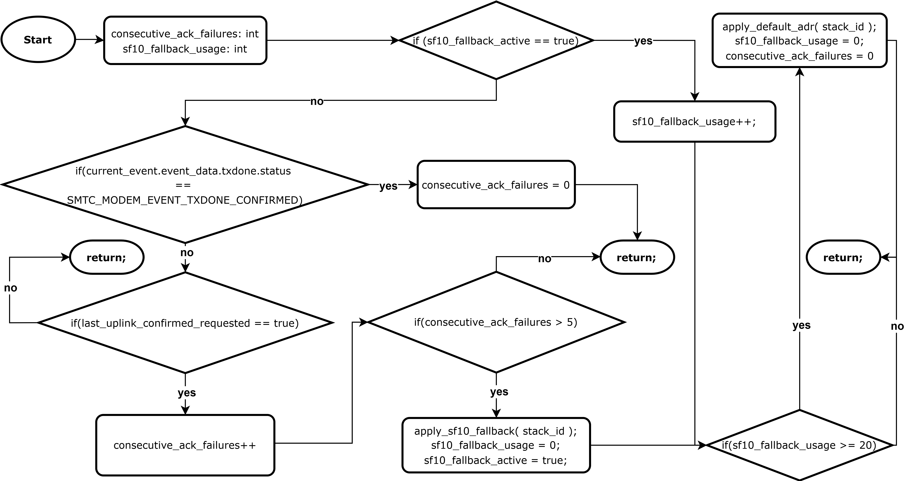

# SF10 fallback supervisor (SWL2001 v4.8.0)

This repository contains a change on top of **SWL2001 v4.8.0** to implement an **SF10 fallback supervisor** based on **confirmed uplink ACK failures**.

## What was changed
- **File:** `lbm_examples/main_examples/main_periodical_uplink.c`
- **Goal:** when consecutive confirmed uplinks do not receive ACK, temporarily force a fallback in **SF10** (ADR custom profile), and return to default ADR after a fixed number of cycles.

## Flowchart

## Key variables (as implemented)
- `consecutive_ack_failures`: counts consecutive confirmed uplinks without ACK
- `sf10_fallback_active`: indicates whether fallback mode is active
- `sf10_fallback_usage`: counts cycles spent in fallback mode
- `last_uplink_confirmed_requested`: indicates whether the last uplink requested confirmation

## Trigger and exit criteria
- Enter fallback when `consecutive_ack_failures > 5` and `sf10_fallback_active == false`
- While fallback is active, increment `sf10_fallback_usage`
- Exit fallback when `sf10_fallback_usage >= 20`, restoring default ADR

## How to cite
Use the GitHub Release `v4.8.0-sf10-fallback.1` and the Zenodo DOI (if enabled).
